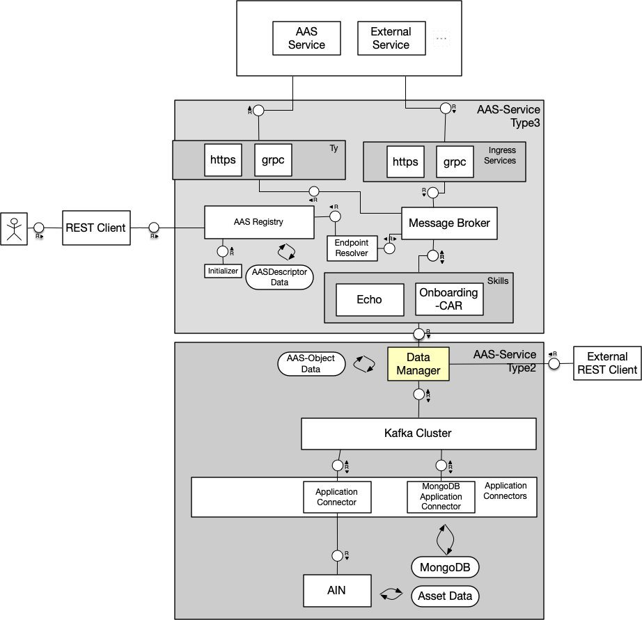

# Help

## Contents

- [Help](#help)
  - [Contents](#contents)
  - [Services](#services)
    - [Overview](#overview)
    - [Architecture](#architecture)
    - [Configuration](#configuration)
    - [Development](#development)
  - [Further Information](#further-information)
  - [FAQs](#faqs)
    - [Q: Is it preferable to run i40-aas-type2 using docker-compose or Kubernetes?](#q-is-it-preferable-to-run-i40-aas-type2-using-docker-compose-or-kubernetes)

## Services

### Overview

Each service on this full list of services included in the repository has a designated _README.md_ with more information about its purpose:

- [data-manager](markdown/data-manager.md)
- [storage-adapter-mongodb](markdown/storage-adapter-mongodb.md)

### Architecture

The following shows the services in a [TAM](http://www.fmc-modeling.org/fmc-and-tam) block diagram. This repository refers only to the "AAS-Service Type2" part of the diagramm. The diagram shows also the relationship between the AAS-Service Type3 and Type2

.

### Configuration

Service configuration is handled via environment variables. In each service's `environment:` section in [docker-compose.yml](../docker-compose.yml) is a full list of environment variables used, some of which can be configured via the [.env](../.env) file in the repository root.

### Development

Local changes affecting a single service require building that service locally.
`docker-compose` can be used:
```bash
## arbitrary <SERVICE>
docker-compose -f docker-compose.dev.yml build i40-aas-<SERVICE>

## e.g. endpoint-resolver
docker-compose -f docker-compose.dev.yml build i40-aas-endpoint-resolver
```

## Further Information

- For instructions on testing the running service look [here](markdown/test.md#Test)

## FAQs

### Q: Is it preferable to run i40-aas-type2 using docker-compose or Kubernetes?

A: Both work. If you have the option to do so, leverage the Helm chart to deploy **i40-aas-type2** to Kubernetes as it allows for easier configuration, maintenance and allows to leverage monitoring/logging capabilities cloud providers.
